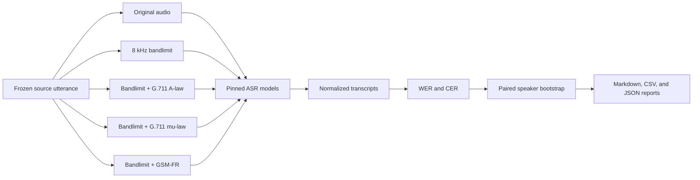

# CallWhisper-8k

[](pyproject.toml)
[](LICENSE)

A reproducible benchmark for Hindi telephony ASR, plus an honest case study of
a Whisper-small LoRA adapter that improved in-domain and failed on frozen
external benchmarks.

> **Project status:** research and ML engineering artifact. This repository is
> not presented as a production-ready ASR service.

## Bottom Line

The benchmark succeeded. The final model adaptation did not.

1. A compact Adalat Whisper-small model was about `1.88x` faster than ARTPARK
   Whisper-medium on a T4, but it lost more accuracy when the same speech was
   converted to telephone-quality audio.
2. That channel-robustness gap appeared on 500 Vaani speakers and replicated on
   132 LAHAJA speakers.
3. LoRA training substantially improved Adalat on held-out GramVaani data, but
   the fixed adapter became worse on the untouched Vaani and LAHAJA benchmarks.
4. The final verdict was `fail_external_generalization`.

This is evidence for a robustness-efficiency tradeoff and for the importance of
frozen external evaluation. It is not evidence that the adapted model is ready
for deployment.

For the complete non-technical story, read
[The Whole Project in Plain English](PROJECT_JOURNEY_PLAIN_ENGLISH.md).

## Headline Results

### 1. Paired Telephone Robustness

Each model transcribed the same utterances in five matched conditions:
original, 8 kHz bandlimited, G.711 A-law, G.711 mu-law, and GSM-FR. The channel
penalty is pooled telephone WER minus original WER. Lower is better.

| Benchmark | Speakers | ARTPARK penalty | Adalat penalty | Adalat minus ARTPARK | 95% CI |
|---|---:|---:|---:|---:|---:|
| Vaani | 500 | +0.0049 | +0.0280 | **+0.0232** | [+0.0166, +0.0300] |
| LAHAJA | 132 | +0.0058 | +0.0350 | **+0.0292** | [+0.0137, +0.0459] |

The confidence intervals are entirely above zero on both datasets. On these
fixed slices and transforms, Adalat was consistently more channel-sensitive
than ARTPARK.

Reports:
[Vaani](results/vaani_paired_model_full_v1.md) and
[LAHAJA](results/lahaja_paired_external_v1.md).

### 2. The Adaptation Failure

The serious LoRA run used 18,000 GramVaani source clips, about 65 view-hours,
3,000 optimizer steps, and a recording-group-disjoint internal split.

| Evaluation | Metric | Base Adalat | Adapted Adalat | Outcome |
|---|---|---:|---:|---|
| Internal GramVaani | Original WER | 0.6031 | **0.4991** | improved |
| Internal GramVaani | Pooled telephone WER | 0.6122 | **0.5087** | improved |
| Frozen Vaani | Original WER | **0.1741** | 0.1993 | regressed |
| Frozen Vaani | Pooled telephone WER | **0.2022** | 0.2262 | regressed |
| Frozen LAHAJA | Original WER | **0.1802** | 0.2000 | regressed |
| Frozen LAHAJA | Pooled telephone WER | **0.2153** | 0.2189 | no improvement |

On Vaani, adapted minus base pooled WER was `+0.0240`, with a paired 95%
interval of `[+0.0158, +0.0320]`. The harm was statistically supported. On
LAHAJA, the pooled difference was uncertain, but the adapter still failed the
predeclared absolute-improvement and clean-regression gates.

The likely explanation is domain overfitting: the adapter learned GramVaani's
speech and transcript patterns more than general telephone robustness.

Full report:
[Frozen Adalat Evaluation](results/adalat_frozen_evaluation_v1.md).

### 3. Fixed-Slice Model Comparison

The same 100 GramVaani files were evaluated with each model. This is useful
engineering evidence, not a global leaderboard.

| Model | Mixed WER | Native 8 kHz WER | Higher-rate WER |
|---|---:|---:|---:|
| Whisper medium | 0.7182 | 0.7889 | 0.6281 |
| Whisper large-v3 | 0.5182 | 0.6083 | 0.4036 |
| ARTPARK Whisper-medium Vaani Hindi | **0.2565** | **0.3091** | **0.1895** |

The natural source-rate groups are confounded by speaker, gender, topic, noise,
and transcript quality. They motivated the later same-utterance paired design;
they do not establish a causal 8 kHz penalty by themselves.

Report: [Model Comparison v2](results/model_comparison_v2.md).

## Why This Benchmark Is Different

A weak comparison takes unrelated clean and telephone recordings, then
attributes every score difference to the channel. CallWhisper-8k instead keeps
the speaker, utterance, words, and reference fixed while changing only the
audio condition.



The audio pipeline validates sample rate, channels, duration, completeness, and
codec support. Manual listening caught an early transform error before model
evaluation; those incorrect codec-only rows were superseded and never used for
the headline result.

## What Is Included

- Manifest-driven Whisper evaluation with per-file WER/CER output.
- Telephony transforms for 8 kHz bandlimiting, G.711 A-law, G.711 mu-law, and
  GSM-FR.
- Multi-reference Vaani scoring and conventional single-reference LAHAJA
  scoring.
- Speaker-clustered paired bootstrap intervals.
- Metadata auditing, diagnostic flags, and human error-review tooling.
- Reproducible Colab notebooks for benchmark construction, GPU inference,
  LoRA training, checkpoint resume, and frozen evaluation.
- A committed pilot LoRA adapter that can be reloaded and evaluated.
- Curated Markdown, CSV, and JSON result artifacts.

## Quickstart

### Install

```bash
git clone https://github.com/anshulLuhsna/CallWhisper-8k.git
cd CallWhisper-8k
python -m venv .venv
source .venv/bin/activate
pip install -e ".[dev]"
```

FFmpeg must be available on the system for audio conversion and Whisper
inference.

### Evaluate Your Own Audio

Create a CSV manifest:

```csv
audio_path,reference_text,slice,condition,language
data/example.wav,reference transcript,example,original,hi
```

Then run:

```bash
callwhisper \
  --manifest datasets/manifests/example.csv \
  --model tiny \
  --language-mode hi \
  --output-json results/example_tiny.json
```

The example manifest is a schema template; provide the referenced audio file
locally. Raw datasets and audio are intentionally not committed.

### Reload the Committed Pilot Adapter

```bash
pip install -e ".[finetune]"

callwhisper-lora-eval \
  --manifest datasets/manifests/gramvaani_dev_50.csv \
  --adapter-dir models/whisper-small-lora-gramvaani-pilot-seed0/final_adapter \
  --processor-dir models/whisper-small-lora-gramvaani-pilot-seed0/processor \
  --output-dir results/lora_reload_eval
```

A GPU is recommended. The serious `serious_labelsafe_v1` adapter is preserved
with its training artifacts in the experiment's persistent Drive output; the
smaller pilot adapter is the model artifact committed here.

## Reproducing The Evidence

There are three reproduction levels:

| Level | What you can do | Data access |
|---|---|---|
| Inspect | Read curated reports, configs, manifests, and aggregate results | none |
| Local CLI | Run the evaluator on your own labelled audio | your own audio |
| Full benchmark | Rebuild paired audio and rerun pinned models/notebooks | gated Vaani/LAHAJA access plus GramVaani files |

The canonical notebook sequence and status are documented in
[notebooks/README.md](notebooks/README.md). Expensive runs pin model or dataset
revisions, save prediction rows immediately, and resume from persistent
checkpoints.

## Repository Map

```text
src/callwhisper/
  audio/       telephony transforms and preprocessing
  datasets/    manifest, inventory, cache, and metadata tools
  eval/        inference, WER/CER, diagnostics, and paired bootstrap
datasets/
  manifests/   fixed benchmark manifests; raw audio is excluded
models/
  whisper-small-lora-gramvaani-pilot-seed0/
notebooks/     17 staged CPU/GPU experiment notebooks
results/       curated reports and machine-readable outputs
tests/         unit tests for scoring, transforms, caches, and audits
```

## Experimental Journey

1. Established manifest-based Whisper evaluation on GramVaani.
2. Compared model size and Hindi-tuned checkpoints on fixed files.
3. Tested decoding changes; beam size 5 helped on the tested large-v3 slice.
4. Added FLEURS Hindi as a cleaner control.
5. Measured simple preprocessing; no method solved the telephone problem.
6. Audited the confounded natural 8 kHz split.
7. Built and validated matched telephony transforms.
8. Found the ARTPARK-Adalat robustness gap on Vaani.
9. Replicated it externally on LAHAJA.
10. Trained a serious Adalat LoRA adapter and passed the internal gate.
11. Ran one frozen external evaluation and rejected the adapter.

The [plain-English project journey](PROJECT_JOURNEY_PLAIN_ENGLISH.md) explains
each step, including the failed runs and what they taught us.

## Limitations

- Results apply to the tested slices, checkpoints, decoding settings, and
  simulated transforms. They do not represent every real phone call.
- Vaani uses alignment-based multi-reference scoring; LAHAJA uses one
  reference. Their absolute WER values should not be compared directly.
- ARTPARK's published training mixture includes Vaani, so its absolute Vaani
  ranking may be affected by training exposure. The externally replicated
  paired channel-penalty gap is the stronger claim.
- The LAHAJA replication uses one deterministic eligible utterance from each of
  132 speakers.
- GramVaani does not provide speaker IDs in the released inventory, so the
  serious training split is recording-group-disjoint, not proven
  speaker-disjoint.
- The external benchmarks are now observed and must not be reused for tuning a
  revised adapter. A new attempt needs a new untouched final holdout.
- Raw speech is not redistributed. Users must follow each upstream dataset's
  access and license terms.
- The repository provides research tooling and notebooks, not a hosted API,
  Docker deployment, streaming system, or production SLA.

## What Failed And What Comes Next

The failed adapter is still useful: it proves the full training pipeline worked,
including dataset preparation, LoRA, attention masks, label-length auditing,
durable checkpoints, adapter reload, and frozen evaluation. What failed was
generalization.

A defensible next attempt would require:

- broader Hindi and Hinglish training domains;
- genuine clean replay rather than only already-telephone GramVaani audio;
- clean-to-telephone paired augmentation;
- multi-domain validation during training;
- gentler adaptation and stronger regularization;
- a new untouched external benchmark for the final decision.

The existing Vaani and LAHAJA results should remain frozen evidence, not become
another tuning loop.

## Key Reports

- [Final frozen adapter evaluation](results/adalat_frozen_evaluation_v1.md)
- [Vaani paired model result](results/vaani_paired_model_full_v1.md)
- [LAHAJA external replication](results/lahaja_paired_external_v1.md)
- [GramVaani model comparison](results/model_comparison_v2.md)
- [Preprocessing ablation](results/preprocessing_v1.md)
- [Decoding adaptation](results/adaptation_v1.md)
- [Manual audio review](results/manual_audio_review_v1.md)
- [Committed LoRA pilot](results/lora_pilot_v1.md)

## License

The code is released under the [MIT License](LICENSE). Dataset licenses and
access restrictions remain governed by their original publishers; see
[datasets/README.md](datasets/README.md).
